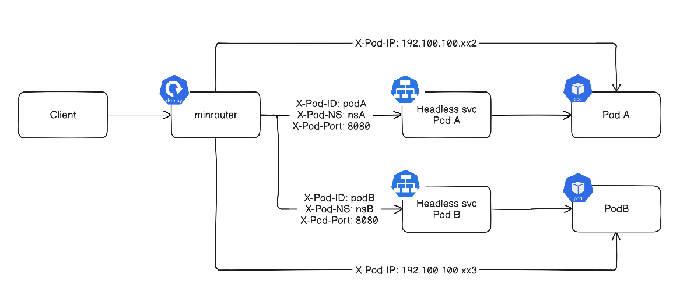

# Minrouter

Minrouter is a lightweight, async reverse proxy designed to provide scalable and dynamic access to hundreds of ephemeral Pods running in Kubernetes cluster. Acts as a central entry point for all Pod traffic.

